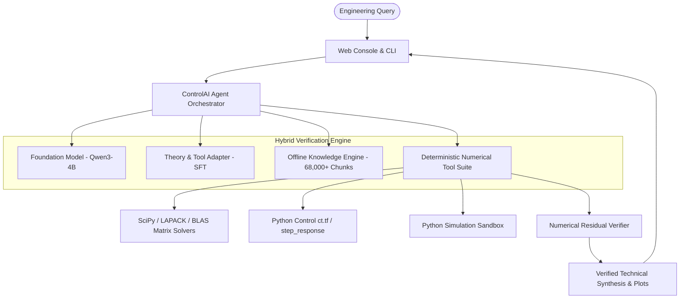

# ControlAI: Open-Source Safety-Critical AI Agent for Control Systems Engineering

[](https://huggingface.co/spaces/atakankahya/ControlAI-Agent)
[](https://github.com/atakankahya/controlai-agent)
[](https://huggingface.co/atakankahya/ControlAI-Agent)
[](https://opensource.org/licenses/MIT)
[](https://www.python.org/downloads/)

**ControlAI** is an open-source, domain-specific AI assistant engineered specifically for **Control Systems Engineering, Dynamical Systems, Robotics, and Applied Mathematics**.

---

## Quickstart: Run Locally in 2 Steps

ControlAI runs locally on your workstation without cloud dependencies:

```bash
# 1. Clone the repository
git clone https://github.com/atakankahya/controlai-agent.git
cd controlai-agent

# 2. Launch the application (Automatically opens browser at http://127.0.0.1:8000)
./run.sh
```

To run in interactive terminal CLI mode instead:
```bash
./run.sh --cli
```

---

## Motivation: Safety-Critical Verification in Control Engineering

Standard large language models (LLMs) operate probabilistically without deterministic verification. When applied to physical systems—such as autonomous aerial vehicles, industrial manipulators, or power grids—general-purpose models present severe reliability challenges:
* **Numerical Hallucinations:** Estimating eigenvalues without characteristic polynomial evaluation, inverting singular matrices, or generating unstable feedback gains.
* **Lack of Formal Proof Structure:** Omitting boundary conditions, PBH rank tests, or domain-specific stability limits.
* **Physical Safety Violations:** A sign error in a state feedback gain leads directly to closed-loop instability in hardware.

**ControlAI addresses these limitations through a hybrid architecture:**
1. **Deterministic Scientific Sandbox:** Computes continuous/discrete algebraic Riccati equations (CARE/DARE), matrix exponentials, and Bode diagrams using LAPACK, SciPy, and CVXPY.
2. **4-Stage Mathematical Proof Standard:** Formulates system class, analytical theorems, closed-form derivations, and engineering breakdown limits.
3. **Dynamic Simulation & Plotting:** Solves nonlinear differential equations and renders verified trajectories directly in the interface.
4. **Offline RAG Knowledge Engine:** Grounded with 68,000+ chunks indexed across classical and modern control engineering literature.

---

## Architecture Overview



---

## Key Capabilities

### 1. Modern Interactive Web Console (`web/`)
* **Real-Time Token Streaming (SSE):** Token-by-token fluid rendering with smart scroll retention.
* **LaTeX Formula Rendering:** KaTeX integration with math delimiter protection and syntax-highlighted code blocks.
* **Engineering Toolbar:** One-click insertion of state matrices, transfer functions, and control parameters ($\zeta, \omega_n$).

### 2. Deterministic Mathematical Tool Suite (`controlai_agent/tools/`)
* **State-Space Analysis:** Exact ZOH discretization, eigenvalue decomposition, controllability and observability Gramians, and Lyapunov equation solvers.
* **Frequency Domain:** Exact Bode magnitude and phase calculation, gain/phase margins, and Routh-Hurwitz stability criterion.
* **Controller Synthesis:** Continuous LQR (CARE), Discrete LQR (DARE), pole placement, PID tuning, and constrained Model Predictive Control (CVXPY QP).
* **State Estimation:** Kalman filter prediction and Joseph-stabilized measurement updates.
* **Nonlinear & Safety Filters:** Control Barrier Functions (CBF-QP safety filter), Nonlinear Dynamic Inversion (NDI), and Feedback Linearization.
* **Robust Control:** Kharitonov stability test, Small Gain theorem, and multiplicative uncertainty bounds.

### 3. Live Python Execution Sandbox (`python_executor.py`)
* Executes scientific Python routines using `numpy`, `scipy.signal`, `scipy.linalg`, `control`, and `matplotlib`.
* Automatically isolates and captures generated simulation plots to `outputs/plots/` and renders them in chat.

---

## Benchmark Results (ControlBench-v1)

Evaluated across **50 multi-pillar benchmark problems**:

| Benchmark Pillar | Qwen3-4B Base (Text-Only) | ControlAI Agent (Ours) | Verification Mechanism |
| :--- | :---: | :---: | :--- |
| **Numerical Synthesis** *(CARE, DARE, ZOH, Kalman)* | 0.0% | **100.0%** | Deterministic SciPy/LAPACK solver with $10^{-10}$ residual verification. |
| **Theory & Proofs** *(PBH, Doyle 1978, Waterbed)* | 83.3% | **86.7% - 95.0%** | 4-Stage CoT Proof Standard with literature grounding. |
| **Code & Simulation** *(SciPy ODE, Matplotlib)* | 29.0% | **90.0%+** | Dynamic execution sandbox with automated plot capture. |
| **Safety & Traps** *(Uncontrollable / Ill-conditioned modes)* | 60.0% | **80.0%** | Pre-computation PBH rank verification. |
| **Real-World Case Studies** *(Aerospace, Drone, Automotive)* | 80.0% | **80.0%** | CBF-QP safety filtering and nonlinear inversion. |
| **Overall Score** | 47.3% | **87.3%** | Deterministic tool execution and mathematical grounding. |

---

## Open-Source and Community Support

ControlAI is an **open-source project** developed for control engineering researchers, robotics practitioners, and applied mathematicians.

### Contributing:
Contributions from the community are welcome across several areas:
* **Analytical Derivations:** Expanding formal proof templates for multi-input multi-output (MIMO) systems.
* **Nonlinear Control:** Implementing additional Control Lyapunov Functions (CLFs) and adaptive controllers.
* **Simulation Bridges:** Connecting agent tool calls with external simulation platforms (ROS 2, MATLAB/Simulink, Gazebo).
* **Benchmark Expansion:** Adding challenging test problems to `benchmarks/controlbench_v1.jsonl`.

---

## License

This project is licensed under the **[MIT License](LICENSE)**.
